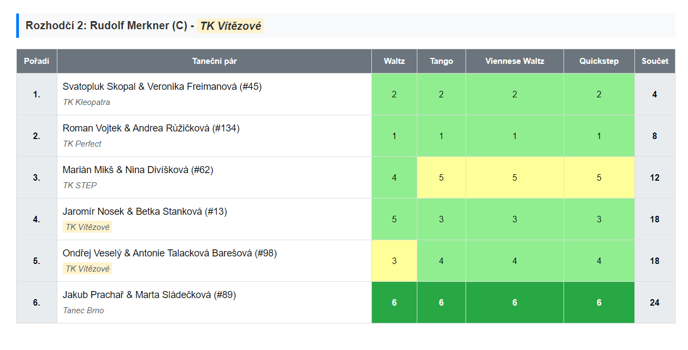
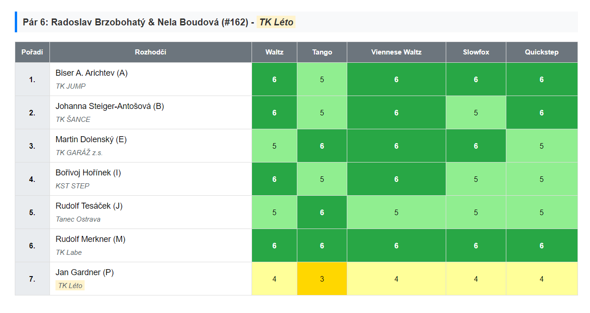

# Analýza výsledků soutěží ČSTS

## Obecné informace

Tato stránka vznikla za účelem rychlé analýzy a vyhledávání anomálií v hodnocení tanečních párů na soutěžích podle vzoru stránky *[https://tanecninoviny.cz/analysis/csts-results](https://tanecninoviny.cz/analysis/csts-results)*, která bohužel přestala fungovat pro soutěže konané po červnu 2024 kvůli technickým změnám na webu [csts.cz](https://www.csts.cz) (přechod na nový systém).

Protože amatérské projekty časem přestávají být udržovány nebo zanikají, je tento projekt postaven na principu maximální jednoduchosti a nezávislosti na serverové části. Výjimkou je samozřejmě samotný web [csts.cz](https://www.csts.cz), odkud se čerpají data pro analýzu konkrétních soutěží. Veškeré zpracování a zobrazování dat probíhá uvnitř samotné stránky, tedy na straně prohlížeče, což zaručuje dlouhodobou dostupnost tohoto řešení pro analýzu, až do okamžiku, kdy na webu [csts.cz](https://www.csts.cz) nedojde k dalším změnám, které by byly neslučitelné se současným stavem.

Díky tomu, že je celé řešení obsaženo v jediné HTML stránce, může jej kdokoliv hostovat kdekoli – lokálně v počítači i na jakémkoliv jiném webu. Tato architektura má však i svá omezení. Například web [csts.cz](https://www.csts.cz) omezuje počet požadavků z jiných webů na jeden za minutu. Pokud si tedy chcete prohlédnout analýzu jiné soutěže dříve než za minutu po načtení té předchozí, narazíte na časovou prodlevu.

Nalezená anomálie nemusí nutně znamenat neférové hodnocení ze strany rozhodčích – to může být ovlivněno mnoha faktory, jak je popsáno například v bakalářské práci KAFONĚK, Lukáš: **Hodnocení rozhodčích ve společenských tancích**, Brno 2007 ([https://is.muni.cz/th/aqx6x/Hodnoceni_rozhodcich_ve_spolecenskych_tancich.pdf](https://is.muni.cz/th/aqx6x/Hodnoceni_rozhodcich_ve_spolecenskych_tancich.pdf)). Přesto pomáhá získat celkový obrázek. Je rovněž nutné chápat, že se jedná o anomálie vzhledem k hodnocení **většiny rozhodčích**, a proto každá situace vždy vyžaduje další zkoumání.

---

## Technické informace

Řešení tvoří jedna HTML stránka s JavaScriptem bez použití externích knihoven.

Z této stránky se provádějí následující volání na web [csts.cz](https://www.csts.cz):

**Hlavní:** `https://www.csts.cz/api/1/competitions/{competitionId}/result` - odkud se získávají všechna základní data o hodnocení párů.

**Doplňkové:** `https://www.csts.cz/api/1/competition_events/${eventId}` – pouze pro zobrazení názvu soutěže a základní klasifikace, které bohužel v hlavním dotazu chybí. Toto volání nijak neovlivňuje hlavní funkčnost analýzy; pokud se nenačte, jedinou komplikací bude, že se nezobrazí název soutěže.

**Doplňkové:** `https://www.csts.cz/api/evidence/clenove/detail-clena/osobni-udaje/${memberId}` – pouze pro zobrazení názvu klubu rozhodčího.

---

## Funkční možnosti

Pro zahájení analýzy je třeba vložit do horního pole této stránky URL výsledků soutěže z webu [csts.cz](https://www.csts.cz) a stisknout tlačítko **"Načíst"** nebo klávesu **Enter**.

**Příklad:**
`https://www.csts.cz/dancesport/vysledky_soutezi/event/XXX/competition/YYYYY`

Existuje také možnost předat identifikátory soutěže přímo v URL pomocí parametrů (query string) `?eventId=XXX&competitionId=YYYYY`. V tomto případě se analýza načte okamžitě po otevření stránky.

**Úplný příklad:**
`https://analyza-vysledku-souteze-csts.github.io?eventId=XXX&competitionId=YYYYY`

Uživatelské rozhraní poskytuje sadu tabulek pro každé kolo soutěže. Existují tedy dva režimy zobrazení:

* **podle rozhodčího** - každá tabulka zobrazuje hodnocení jednoho rozhodčího pro všechny páry (podobně jako na výsledkových lístcích i na webu [csts.cz](https://www.csts.cz)).
* **podle soutěžního páru** - každá tabulka zobrazuje hodnocení jednoho páru všemi rozhodčími.

Pro finálové kolo se v tabulkách zvýrazňuje rozdíl mezi hodnocením rozhodčího a finálním celkovým hodnocením páru v daném tanci.

Pro kvalifikační kolo se zvýrazňují křížky a také páry, které postoupily do dalšího kola. Zvýrazňuje se také rozdíl mezi celkovým hodnocením páru a jeho hodnocením v daném kole.

U všech kol jsou barevně zvýrazněni rozhodčí a páry, kteří patří do stejného klubu.

Je možný rychlý přechod na konkrétní pár nebo rozhodčího.

---

---

---

---

## Zpětná vazba

* **Hlášení chyb:** [GitHub Issues](https://github.com/analyza-vysledku-souteze-csts/analyza-vysledku-souteze-csts.github.io/issues)
* **Diskuze:** [GitHub Discussions](https://github.com/analyza-vysledku-souteze-csts/analyza-vysledku-souteze-csts.github.io/discussions)

## Vyzkoušet analýzu

[https://analyza-vysledku-souteze-csts.github.io](https://analyza-vysledku-souteze-csts.github.io)
